# Documentación del Schema de Base de Datos (Fase 0)

Este documento describe el esquema inicial de la base de datos de la **Plataforma Freelance (Web + Supabase)**.
Está pensado para servir como contrato de datos tanto para el frontend web como para que el equipo que construye el esqueleto de la **app móvil en Flutter** pueda modelar sus entidades en Dart sin necesidad de una conexión real en esta etapa.

---

## 1. Diagrama Entidad-Relación (ERD)

```mermaid
erDiagram
    AUTH_USERS ||--|| PROFILES : "1 a 1 (id = auth.users.id)"
    PROFILES ||--|{ USER_ROLES : "1 a muchos (user_roles.user_id)"
    PROFILES ||--|{ SERVICES : "1 a muchos (services.freelancer_id)"
    CATEGORIES ||--|{ SERVICES : "1 a muchos (services.category_id)"
    SERVICES ||--|{ SERVICE_PACKAGES : "1 a muchos (service_packages.service_id)"
    PROFILES ||--|{ ORDERS : "1 a muchos como cliente (orders.client_id)"
    PROFILES ||--|{ ORDERS : "1 a muchos como freelancer (orders.freelancer_id)"
    ORDERS ||--|{ ORDER_REQUIREMENTS : "1 a muchos (order_requirements.order_id)"
    ORDERS ||--|{ ORDER_STATUS_HISTORY : "1 a muchos (order_status_history.order_id)"
    ORDERS ||--o| ESCROW_HOLDS : "1 a 1 (escrow_holds.order_id)"
    ORDERS ||--|{ PAYMENTS : "1 a muchos (payments.order_id)"
    ORDERS ||--o{ PAYOUTS : "1 a muchos (payouts.order_id)"
    ESCROW_HOLDS ||--|| PLATFORM_FEES : "1 a 1 (platform_fees.escrow_id)"
    ORDERS ||--o{ DISPUTES : "1 a muchos (disputes.order_id)"
    DISPUTES ||--|{ DISPUTE_MESSAGES : "1 a muchos (dispute_messages.dispute_id)"
    DISPUTES ||--o| DISPUTE_RESOLUTIONS : "1 a 1 (dispute_resolutions.dispute_id)"
    ORDERS ||--o| REVIEWS : "1 a 1 (reviews.order_id)"
    PROFILES ||--o{ REVIEWS : "1 a muchos (reviews.freelancer_id)"
    PROFILES ||--o{ REVIEWS : "1 a muchos (reviews.client_id)"
    SERVICES ||--o{ REVIEWS : "1 a muchos (reviews.service_id)"
    PROFILES ||--o{ CONVERSATIONS : "1 a muchos como cliente (conversations.client_id)"
    PROFILES ||--o{ CONVERSATIONS : "1 a muchos como freelancer (conversations.freelancer_id)"
    ORDERS ||--o{ CONVERSATIONS : "1 a muchos vinculadas (conversations.order_id)"
    CONVERSATIONS ||--|{ MESSAGES : "1 a muchos (messages.conversation_id)"
    PROFILES ||--o{ MESSAGES : "1 a muchos emitidos (messages.sender_id)"
    PROFILES ||--o{ NOTIFICATIONS : "1 a muchos recibidas (notifications.user_id)"

    AUTH_USERS {
        uuid id PK
        string email
        timestamptz created_at
    }

    PROFILES {
        uuid id PK,FK "auth.users.id"
        string full_name "Nombre completo"
        string avatar_url "URL avatar"
        string phone "Teléfono de contacto"
        boolean phone_verified "Teléfono verificado (default: false)"
        string headline "Título o especialidad profesional"
        string bio "Biografía o presentación"
        numeric hourly_rate "Tarifa por hora en USD"
        string_array skills "Array de etiquetas de habilidades"
        jsonb portfolio "Lista de proyectos de portafolio"
        numeric rating_avg "Promedio de calificaciones (1.00 - 5.00)"
        int reviews_count "Total de reseñas acumuladas"
        timestamptz created_at "Fecha de creación"
        timestamptz updated_at "Fecha de última actualización"
    }

    USER_ROLES {
        uuid user_id PK,FK "profiles.id"
        role_type role PK "cliente | freelancer | admin | soporte"
        boolean active "Rol activo (default: true)"
        timestamptz created_at "Fecha de asignación"
    }

    CATEGORIES {
        uuid id PK
        string name "Nombre de la categoría"
        string slug UK "Identificador URL amigable"
        string description "Descripción temática"
        string icon "Icono o emoji representativo"
        timestamptz created_at "Fecha de creación"
    }

    SERVICES {
        uuid id PK
        uuid freelancer_id FK "profiles.id"
        uuid category_id FK "categories.id"
        string title "Título de la oferta de servicio"
        string description "Detalle del alcance del servicio"
        numeric price "Precio base o inicial en USD"
        int delivery_days "Días estimados de entrega"
        string cover_image "URL imagen de portada"
        string status "active | paused | draft"
        numeric rating "Calificación promedio (1.00 - 5.00)"
        int reviews_count "Total de reseñas acumuladas"
        timestamptz created_at "Fecha de publicación"
        timestamptz updated_at "Fecha de última actualización"
    }

    SERVICE_PACKAGES {
        uuid id PK
        uuid service_id FK "services.id"
        string tier "basico | estandar | premium"
        string title "Nombre del paquete"
        string description "Alcance específico del paquete"
        numeric price "Precio en USD del paquete"
        int delivery_days "Tiempo de entrega en días"
        int revisions "Revisiones permitidas"
        timestamptz created_at "Fecha de creación"
    }

    ORDERS {
        uuid id PK
        uuid client_id FK "profiles.id"
        uuid freelancer_id FK "profiles.id"
        uuid service_id FK "services.id (opcional)"
        uuid package_id FK "service_packages.id (opcional)"
        string title "Título del trabajo/acuerdo"
        string description "Descripción de los requerimientos acordados"
        numeric price "Monto acordado en USD"
        int delivery_days "Días de entrega acordados"
        string status "pendiente_acuerdo | acordado | esperando_pago | en_progreso | entregado | aprobado | en_disputa | cerrado"
        timestamptz agreed_at "Fecha de confirmación del acuerdo"
        timestamptz payment_activated_at "Fecha en que freelancer activó el pago"
        timestamptz delivery_due_date "Fecha límite estimada de entrega"
        timestamptz delivered_at "Fecha de entrega"
        timestamptz completed_at "Fecha de aprobación final"
        timestamptz created_at "Fecha de creación"
        timestamptz updated_at "Última actualización"
    }

    ORDER_REQUIREMENTS {
        uuid id PK
        uuid order_id FK "orders.id"
        string description "Entregable o requerimiento específico"
        boolean is_completed "Completado (default: false)"
        timestamptz created_at "Fecha de registro"
    }

    ORDER_STATUS_HISTORY {
        uuid id PK
        uuid order_id FK "orders.id"
        string previous_status "Estado anterior"
        string new_status "Nuevo estado alcanzado"
        uuid changed_by FK "profiles.id"
        string comment "Comentario o justificación del cambio"
        timestamptz created_at "Fecha y hora del cambio"
    }

    PAYMENTS {
        uuid id PK
        uuid order_id FK "orders.id"
        uuid client_id FK "profiles.id"
        numeric amount "Monto depositado"
        string currency "USD"
        string status "held_in_escrow | released | partially_refunded | refunded"
        string payment_provider "simulado | stripe"
        string provider_transaction_id "ID de transacción"
        timestamptz created_at "Fecha de pago"
        timestamptz updated_at "Última actualización"
    }

    ESCROW_HOLDS {
        uuid id PK
        uuid order_id UK,FK "orders.id"
        uuid payment_id FK "payments.id"
        numeric amount "Monto total retenido"
        numeric platform_fee "Comisión retenida de la plataforma"
        numeric net_amount "Monto neto para el freelancer"
        string status "held | released | partially_released | refunded"
        timestamptz released_at "Fecha de liberación"
        timestamptz created_at "Fecha de retención"
        timestamptz updated_at "Última actualización"
    }

    PAYOUTS {
        uuid id PK
        uuid order_id FK "orders.id"
        uuid freelancer_id FK "profiles.id"
        numeric amount "Monto neto desembolsado"
        string status "pending | completed | failed"
        string payout_provider "simulado | stripe"
        string provider_payout_id "ID de transferencia"
        timestamptz processed_at "Fecha de procesamiento"
        timestamptz created_at "Fecha de registro"
    }

    PLATFORM_FEES {
        uuid id PK
        uuid order_id FK "orders.id"
        uuid escrow_id FK "escrow_holds.id"
        numeric fee_percentage "Porcentaje (default: 10%)"
        numeric fee_amount "Monto de la comisión en USD"
        timestamptz created_at "Fecha de registro"
    }

    DISPUTES {
        uuid id PK
        uuid order_id FK "orders.id"
        uuid initiator_id FK "profiles.id"
        uuid respondent_id FK "profiles.id"
        string reason "Motivo de la disputa"
        string description "Descripción detallada del desacuerdo"
        string status "open | under_review | resolved | cancelled"
        timestamptz created_at "Fecha de apertura"
        timestamptz updated_at "Última actualización"
    }

    DISPUTE_MESSAGES {
        uuid id PK
        uuid dispute_id FK "disputes.id"
        uuid sender_id FK "profiles.id"
        string message "Mensaje de exposición o respuesta"
        jsonb attachments "Lista de evidencias adjuntas"
        boolean is_support "Mensaje de mediación oficial (default: false)"
        timestamptz created_at "Fecha de envío"
    }

    DISPUTE_RESOLUTIONS {
        uuid id PK
        uuid dispute_id UK,FK "disputes.id"
        uuid resolver_id FK "profiles.id"
        string decision "no_liberar | liberar_completo | liberar_parcial"
        numeric freelancer_percentage "Porcentaje al freelancer (0-100%)"
        string resolution_notes "Veredicto del mediador"
        timestamptz created_at "Fecha de resolución"
    }

    REVIEWS {
        uuid id PK
        uuid order_id UK,FK "orders.id"
        uuid client_id FK "profiles.id"
        uuid freelancer_id FK "profiles.id"
        uuid service_id FK "services.id"
        int rating "Calificación 1 a 5 estrellas"
        string comment "Comentario o testimonio del cliente"
        string freelancer_reply "Réplica oficial del freelancer"
        timestamptz freelancer_replied_at "Fecha de respuesta del freelancer"
        timestamptz created_at "Fecha de emisión"
        timestamptz updated_at "Fecha de última edición"
    }

    CONVERSATIONS {
        uuid id PK
        uuid client_id FK "profiles.id"
        uuid freelancer_id FK "profiles.id"
        uuid order_id FK "orders.id (opcional)"
        string last_message "Último mensaje enviado"
        timestamptz last_message_at "Fecha del último mensaje"
        timestamptz created_at "Fecha de creación"
        timestamptz updated_at "Última actualización"
    }

    MESSAGES {
        uuid id PK
        uuid conversation_id FK "conversations.id"
        uuid sender_id FK "profiles.id"
        string content "Texto del mensaje"
        jsonb attachments "Archivos o imágenes adjuntas"
        boolean is_read "Indicador de lectura (default: false)"
        timestamptz created_at "Fecha de envío"
    }

    NOTIFICATIONS {
        uuid id PK
        uuid user_id FK "profiles.id"
        string title "Título de la notificación"
        string message "Cuerpo del mensaje"
        string type "Tipo de evento (order, message, dispute, etc.)"
        jsonb data "Metadatos asociados (IDs, URLs)"
        boolean is_read "Estado de lectura (default: false)"
        timestamptz read_at "Fecha en que se marcó como leída"
        timestamptz created_at "Fecha de emisión"
    }
```



---

## 2. Tipos y Enums

### `role_type` (Enum PostgreSQL)
Define los posibles roles dentro de la plataforma:
- `'cliente'`: Usuario que contrata servicios freelance.
- `'freelancer'`: Usuario que ofrece servicios y recibe pagos vía escrow.
- `'admin'`: Administrador del sistema y configuración.
- `'soporte'`: Mediador de disputas y atención al usuario.

> [!NOTE]
> Una cuenta puede tener múltiples roles a la vez (por ejemplo, ser `cliente` y `freelancer` simultáneamente). Cada rol tiene su propio registro en `user_roles`.

---

## 3. Tablas Detalladas

### Tabla `public.profiles`
Espejo en `public` de `auth.users` que almacena los datos de perfil propios de la plataforma.

| Campo | Tipo PostgreSQL | Nulo | Por defecto | Descripción |
| :--- | :--- | :---: | :--- | :--- |
| `id` | `uuid` | NO | - | Clave primaria. Coincide exactamente con `auth.users(id)` (ON DELETE CASCADE). |
| `full_name` | `text` | SÍ | `null` | Nombre completo del usuario. |
| `avatar_url` | `text` | SÍ | `null` | URL de la imagen de perfil en Supabase Storage. |
| `phone` | `text` | SÍ | `null` | Teléfono móvil del usuario. |
| `phone_verified` | `boolean` | NO | `false` | Indica si el teléfono fue verificado. |
| `headline` | `text` | SÍ | `null` | Título profesional (ej: Diseñador UI/UX). |
| `bio` | `text` | SÍ | `null` | Biografía o propuesta de valor. |
| `hourly_rate` | `numeric(10,2)` | SÍ | `null` | Tarifa estimada por hora en USD. |
| `skills` | `text[]` | NO | `'{}'` | Array de nombres de habilidades. |
| `portfolio` | `jsonb` | NO | `'[]'` | Array JSON de proyectos con título, descripción y url. |
| `created_at` | `timestamptz` | NO | `now()` | Fecha y hora de creación. |
| `updated_at` | `timestamptz` | NO | `now()` | Fecha y hora de última modificación (manejada por trigger). |
| :--- | :--- | :---: | :--- | :--- |
| `id` | `uuid` | NO | - | Clave primaria. Coincide exactamente con `auth.users(id)` (ON DELETE CASCADE). |
| `full_name` | `text` | SÍ | `null` | Nombre completo del usuario. |
| `avatar_url` | `text` | SÍ | `null` | URL de la imagen de perfil en Supabase Storage. |
| `phone` | `text` | SÍ | `null` | Teléfono móvil del usuario. |
| `phone_verified` | `boolean` | NO | `false` | Indica si el teléfono fue verificado. |
| `created_at` | `timestamptz` | NO | `now()` | Fecha y hora de creación. |
| `updated_at` | `timestamptz` | NO | `now()` | Fecha y hora de última modificación (manejada por trigger). |

### Tabla `public.user_roles`
Maneja la relación de roles por usuario con clave primaria compuesta `(user_id, role)`.

| Campo | Tipo PostgreSQL | Nulo | Por defecto | Descripción |
| :--- | :--- | :---: | :--- | :--- |
| `user_id` | `uuid` | NO | - | FK que referencia a `public.profiles(id)` (ON DELETE CASCADE). |
| `role` | `public.role_type` | NO | - | Valor del enum (`cliente`, `freelancer`, `admin`, `soporte`). |
| `active` | `boolean` | NO | `true` | Si el rol está habilitado o suspendido. |
| `created_at` | `timestamptz` | NO | `now()` | Fecha y hora en que se asignó el rol. |

---

## 4. Triggers y Lógica Automática

1. **`on_auth_user_created` (en `auth.users`):**
   - Se dispara tras insertar un nuevo registro en `auth.users`.
   - Función `public.handle_new_user()` (Security Definer).
   - Crea automáticamente la fila en `public.profiles` con `id` y `full_name` (extraído de `raw_user_meta_data`).
   - Inserta automáticamente el rol `'cliente'` en `public.user_roles`. El rol `'freelancer'` se habilita posteriormente desde la interfaz de perfil (Fase 1).

2. **`profiles_set_updated_at` (en `public.profiles`):**
   - Se dispara antes de cada `UPDATE`.
   - Actualiza automáticamente la columna `updated_at` al timestamp actual `now()`.

---

## 5. Políticas de Seguridad (RLS - Row Level Security)

- **`profiles`:**
  - `SELECT`: Cualquier usuario autenticado puede leer perfiles (necesario para ver freelancers en el marketplace).
  - `UPDATE`: Un usuario solo puede modificar su propio perfil (`auth.uid() = id`).
- **`user_roles`:**
  - `SELECT`: Un usuario solo puede consultar sus propios roles (`auth.uid() = user_id`).
  - `INSERT`: Un usuario solo puede auto-asignarse los roles `'cliente'` o `'freelancer'`. La asignación de `'admin'` o `'soporte'` solo puede realizarse vía service_role o panel interno.

---

## 6. Modelos en Dart para la App en Flutter

Para quien desarrolle la aplicación móvil en Flutter, a continuación se incluyen las clases Dart equivalentes con serialización JSON compatible con Supabase:

### `role_type.dart`
```dart
enum RoleType {
  cliente,
  freelancer,
  admin,
  soporte;

  static RoleType fromString(String value) {
    switch (value) {
      case 'cliente':
        return RoleType.cliente;
      case 'freelancer':
        return RoleType.freelancer;
      case 'admin':
        return RoleType.admin;
      case 'soporte':
        return RoleType.soporte;
      default:
        throw ArgumentError('Rol no reconocido: $value');
    }
  }

  String toValue() => name;
}
```

### `user_role.dart`
```dart
import 'role_type.dart';

class UserRole {
  final String userId;
  final RoleType role;
  final bool active;
  final DateTime createdAt;

  const UserRole({
    required this.userId,
    required this.role,
    this.active = true,
    required this.createdAt,
  });

  factory UserRole.fromJson(Map<String, dynamic> json) {
    return UserRole(
      userId: json['user_id'] as String,
      role: RoleType.fromString(json['role'] as String),
      active: json['active'] as bool? ?? true,
      createdAt: DateTime.parse(json['created_at'] as String),
    );
  }

  Map<String, dynamic> toJson() {
    return {
      'user_id': userId,
      'role': role.toValue(),
      'active': active,
      'created_at': createdAt.toIso8601String(),
    };
  }
}
```

### `profile.dart`
```dart
class Profile {
  final String id;
  final String? fullName;
  final String? avatarUrl;
  final String? phone;
  final bool phoneVerified;
  final String? headline;
  final String? bio;
  final double? hourlyRate;
  final List<String> skills;
  final List<Map<String, dynamic>> portfolio;
  final DateTime createdAt;
  final DateTime updatedAt;

  const Profile({
    required this.id,
    this.fullName,
    this.avatarUrl,
    this.phone,
    this.phoneVerified = false,
    this.headline,
    this.bio,
    this.hourlyRate,
    this.skills = const [],
    this.portfolio = const [],
    required this.createdAt,
    required this.updatedAt,
  });

  factory Profile.fromJson(Map<String, dynamic> json) {
    return Profile(
      id: json['id'] as String,
      fullName: json['full_name'] as String?,
      avatarUrl: json['avatar_url'] as String?,
      phone: json['phone'] as String?,
      phoneVerified: json['phone_verified'] as bool? ?? false,
      headline: json['headline'] as String?,
      bio: json['bio'] as String?,
      hourlyRate: (json['hourly_rate'] as num?)?.toDouble(),
      skills: (json['skills'] as List<dynamic>?)?.map((e) => e.toString()).toList() ?? const [],
      portfolio: (json['portfolio'] as List<dynamic>?)?.map((e) => Map<String, dynamic>.from(e as Map)).toList() ?? const [],
      createdAt: DateTime.parse(json['created_at'] as String),
      updatedAt: DateTime.parse(json['updated_at'] as String),
    );
  }

  Map<String, dynamic> toJson() {
    return {
      'id': id,
      'full_name': fullName,
      'avatar_url': avatarUrl,
      'phone': phone,
      'phone_verified': phoneVerified,
      'headline': headline,
      'bio': bio,
      'hourly_rate': hourlyRate,
      'skills': skills,
      'portfolio': portfolio,
      'created_at': createdAt.toIso8601String(),
      'updated_at': updatedAt.toIso8601String(),
    };
  }
}
```

### `order.dart`
```dart
enum OrderStatus {
  pendienteAcuerdo,
  acordado,
  esperandoPago,
  enProgreso,
  entregado,
  aprobado,
  enDisputa,
  cerrado;

  static OrderStatus fromString(String val) {
    switch (val) {
      case 'pendiente_acuerdo':
        return OrderStatus.pendienteAcuerdo;
      case 'acordado':
        return OrderStatus.acordado;
      case 'esperando_pago':
        return OrderStatus.esperandoPago;
      case 'en_progreso':
        return OrderStatus.enProgreso;
      case 'entregado':
        return OrderStatus.entregado;
      case 'aprobado':
        return OrderStatus.aprobado;
      case 'en_disputa':
        return OrderStatus.enDisputa;
      case 'cerrado':
        return OrderStatus.cerrado;
      default:
        return OrderStatus.pendienteAcuerdo;
    }
  }

  String toValue() {
    switch (this) {
      case OrderStatus.pendienteAcuerdo:
        return 'pendiente_acuerdo';
      case OrderStatus.acordado:
        return 'acordado';
      case OrderStatus.esperandoPago:
        return 'esperando_pago';
      case OrderStatus.enProgreso:
        return 'en_progreso';
      case OrderStatus.entregado:
        return 'entregado';
      case OrderStatus.aprobado:
        return 'aprobado';
      case OrderStatus.enDisputa:
        return 'en_disputa';
      case OrderStatus.cerrado:
        return 'cerrado';
    }
  }
}

class OrderModel {
  final String id;
  final String clientId;
  final String freelancerId;
  final String? serviceId;
  final String? packageId;
  final String title;
  final String description;
  final double price;
  final int deliveryDays;
  final OrderStatus status;
  final DateTime? agreedAt;
  final DateTime? paymentActivatedAt;
  final DateTime? deliveryDueDate;
  final DateTime? deliveredAt;
  final DateTime? completedAt;
  final DateTime createdAt;
  final DateTime updatedAt;

  const OrderModel({
    required this.id,
    required this.clientId,
    required this.freelancerId,
    this.serviceId,
    this.packageId,
    required this.title,
    required this.description,
    required this.price,
    required this.deliveryDays,
    required this.status,
    this.agreedAt,
    this.paymentActivatedAt,
    this.deliveryDueDate,
    this.deliveredAt,
    this.completedAt,
    required this.createdAt,
    required this.updatedAt,
  });

  factory OrderModel.fromJson(Map<String, dynamic> json) {
    return OrderModel(
      id: json['id'] as String,
      clientId: json['client_id'] as String,
      freelancerId: json['freelancer_id'] as String,
      serviceId: json['service_id'] as String?,
      packageId: json['package_id'] as String?,
      title: json['title'] as String,
      description: json['description'] as String,
      price: (json['price'] as num).toDouble(),
      deliveryDays: json['delivery_days'] as int,
      status: OrderStatus.fromString(json['status'] as String),
      agreedAt: json['agreed_at'] != null ? DateTime.parse(json['agreed_at'] as String) : null,
      paymentActivatedAt: json['payment_activated_at'] != null ? DateTime.parse(json['payment_activated_at'] as String) : null,
      deliveryDueDate: json['delivery_due_date'] != null ? DateTime.parse(json['delivery_due_date'] as String) : null,
      deliveredAt: json['delivered_at'] != null ? DateTime.parse(json['delivered_at'] as String) : null,
      completedAt: json['completed_at'] != null ? DateTime.parse(json['completed_at'] as String) : null,
      createdAt: DateTime.parse(json['created_at'] as String),
      updatedAt: DateTime.parse(json['updated_at'] as String),
    );
  }
}

class EscrowHoldModel {
  final String id;
  final String orderId;
  final String paymentId;
  final double amount;
  final double platformFee;
  final double netAmount;
  final String status;
  final DateTime? releasedAt;
  final DateTime createdAt;
  final DateTime updatedAt;

  EscrowHoldModel({
    required this.id,
    required this.orderId,
    required this.paymentId,
    required this.amount,
    required this.platformFee,
    required this.netAmount,
    required this.status,
    this.releasedAt,
    required this.createdAt,
    required this.updatedAt,
  });

  factory EscrowHoldModel.fromJson(Map<String, dynamic> json) {
    return EscrowHoldModel(
      id: json['id'] as String,
      orderId: json['order_id'] as String,
      paymentId: json['payment_id'] as String,
      amount: (json['amount'] as num).toDouble(),
      platformFee: (json['platform_fee'] as num).toDouble(),
      netAmount: (json['net_amount'] as num).toDouble(),
      status: json['status'] as String,
      releasedAt: json['released_at'] != null ? DateTime.parse(json['released_at'] as String) : null,
      createdAt: DateTime.parse(json['created_at'] as String),
      updatedAt: DateTime.parse(json['updated_at'] as String),
    );
  }
}

class PayoutModel {
  final String id;
  final String orderId;
  final String freelancerId;
  final double amount;
  final String status;
  final String payoutProvider;
  final String? providerPayoutId;
  final DateTime? processedAt;
  final DateTime createdAt;

  PayoutModel({
    required this.id,
    required this.orderId,
    required this.freelancerId,
    required this.amount,
    required this.status,
    required this.payoutProvider,
    this.providerPayoutId,
    this.processedAt,
    required this.createdAt,
  });

  factory PayoutModel.fromJson(Map<String, dynamic> json) {
    return PayoutModel(
      id: json['id'] as String,
      orderId: json['order_id'] as String,
      freelancerId: json['freelancer_id'] as String,
      amount: (json['amount'] as num).toDouble(),
      status: json['status'] as String,
      payoutProvider: json['payout_provider'] as String,
      providerPayoutId: json['provider_payout_id'] as String?,
      processedAt: json['processed_at'] != null ? DateTime.parse(json['processed_at'] as String) : null,
      createdAt: DateTime.parse(json['created_at'] as String),
    );
  }
}

class DisputeModel {
  final String id;
  final String orderId;
  final String initiatorId;
  final String respondentId;
  final String reason;
  final String description;
  final String status;
  final DateTime createdAt;
  final DateTime updatedAt;

  DisputeModel({
    required this.id,
    required this.orderId,
    required this.initiatorId,
    required this.respondentId,
    required this.reason,
    required this.description,
    required this.status,
    required this.createdAt,
    required this.updatedAt,
  });

  factory DisputeModel.fromJson(Map<String, dynamic> json) {
    return DisputeModel(
      id: json['id'] as String,
      orderId: json['order_id'] as String,
      initiatorId: json['initiator_id'] as String,
      respondentId: json['respondent_id'] as String,
      reason: json['reason'] as String,
      description: json['description'] as String,
      status: json['status'] as String,
      createdAt: DateTime.parse(json['created_at'] as String),
      updatedAt: DateTime.parse(json['updated_at'] as String),
    );
  }
}

class DisputeMessageModel {
  final String id;
  final String disputeId;
  final String senderId;
  final String message;
  final dynamic attachments;
  final bool isSupport;
  final DateTime createdAt;

  DisputeMessageModel({
    required this.id,
    required this.disputeId,
    required this.senderId,
    required this.message,
    this.attachments,
    required this.isSupport,
    required this.createdAt,
  });

  factory DisputeMessageModel.fromJson(Map<String, dynamic> json) {
    return DisputeMessageModel(
      id: json['id'] as String,
      disputeId: json['dispute_id'] as String,
      senderId: json['sender_id'] as String,
      message: json['message'] as String,
      attachments: json['attachments'],
      isSupport: json['is_support'] as bool? ?? false,
      createdAt: DateTime.parse(json['created_at'] as String),
    );
  }
}

class DisputeResolutionModel {
  final String id;
  final String disputeId;
  final String resolverId;
  final String decision;
  final double freelancerPercentage;
  final String resolutionNotes;
  final DateTime createdAt;

  DisputeResolutionModel({
    required this.id,
    required this.disputeId,
    required this.resolverId,
    required this.decision,
    required this.freelancerPercentage,
    required this.resolutionNotes,
    required this.createdAt,
  });

  factory DisputeResolutionModel.fromJson(Map<String, dynamic> json) {
    return DisputeResolutionModel(
      id: json['id'] as String,
      disputeId: json['dispute_id'] as String,
      resolverId: json['resolver_id'] as String,
      decision: json['decision'] as String,
      freelancerPercentage: (json['freelancer_percentage'] as num).toDouble(),
      resolutionNotes: json['resolution_notes'] as String,
      createdAt: DateTime.parse(json['created_at'] as String),
    );
  }
}

class ReviewModel {
  final String id;
  final String orderId;
  final String clientId;
  final String freelancerId;
  final String? serviceId;
  final int rating;
  final String comment;
  final String? freelancerReply;
  final DateTime? freelancerRepliedAt;
  final DateTime createdAt;
  final DateTime updatedAt;

  ReviewModel({
    required this.id,
    required this.orderId,
    required this.clientId,
    required this.freelancerId,
    this.serviceId,
    required this.rating,
    required this.comment,
    this.freelancerReply,
    this.freelancerRepliedAt,
    required this.createdAt,
    required this.updatedAt,
  });

  factory ReviewModel.fromJson(Map<String, dynamic> json) {
    return ReviewModel(
      id: json['id'] as String,
      orderId: json['order_id'] as String,
      clientId: json['client_id'] as String,
      freelancerId: json['freelancer_id'] as String,
      serviceId: json['service_id'] as String?,
      rating: json['rating'] as int,
      comment: json['comment'] as String,
      freelancerReply: json['freelancer_reply'] as String?,
      freelancerRepliedAt: json['freelancer_replied_at'] != null
          ? DateTime.parse(json['freelancer_replied_at'] as String)
          : null,
      createdAt: DateTime.parse(json['created_at'] as String),
      updatedAt: DateTime.parse(json['updated_at'] as String),
    );
  }

  Map<String, dynamic> toJson() {
    return {
      'id': id,
      'order_id': orderId,
      'client_id': clientId,
      'freelancer_id': freelancerId,
      'service_id': serviceId,
      'rating': rating,
      'comment': comment,
      'freelancer_reply': freelancerReply,
      'freelancer_replied_at': freelancerRepliedAt?.toIso8601String(),
      'created_at': createdAt.toIso8601String(),
      'updated_at': updatedAt.toIso8601String(),
    };
  }
}

class ConversationModel {
  final String id;
  final String clientId;
  final String freelancerId;
  final String? orderId;
  final String? lastMessage;
  final DateTime lastMessageAt;
  final DateTime createdAt;
  final DateTime updatedAt;

  ConversationModel({
    required this.id,
    required this.clientId,
    required this.freelancerId,
    this.orderId,
    this.lastMessage,
    required this.lastMessageAt,
    required this.createdAt,
    required this.updatedAt,
  });

  factory ConversationModel.fromJson(Map<String, dynamic> json) {
    return ConversationModel(
      id: json['id'] as String,
      clientId: json['client_id'] as String,
      freelancerId: json['freelancer_id'] as String,
      orderId: json['order_id'] as String?,
      lastMessage: json['last_message'] as String?,
      lastMessageAt: DateTime.parse(json['last_message_at'] as String),
      createdAt: DateTime.parse(json['created_at'] as String),
      updatedAt: DateTime.parse(json['updated_at'] as String),
    );
  }

  Map<String, dynamic> toJson() {
    return {
      'id': id,
      'client_id': clientId,
      'freelancer_id': freelancerId,
      'order_id': orderId,
      'last_message': lastMessage,
      'last_message_at': lastMessageAt.toIso8601String(),
      'created_at': createdAt.toIso8601String(),
      'updated_at': updatedAt.toIso8601String(),
    };
  }
}

class MessageModel {
  final String id;
  final String conversationId;
  final String senderId;
  final String content;
  final List<dynamic> attachments;
  final bool isRead;
  final DateTime createdAt;

  MessageModel({
    required this.id,
    required this.conversationId,
    required this.senderId,
    required this.content,
    required this.attachments,
    required this.isRead,
    required this.createdAt,
  });

  factory MessageModel.fromJson(Map<String, dynamic> json) {
    return MessageModel(
      id: json['id'] as String,
      conversationId: json['conversation_id'] as String,
      senderId: json['sender_id'] as String,
      content: json['content'] as String,
      attachments: json['attachments'] as List<dynamic>? ?? [],
      isRead: json['is_read'] as bool? ?? false,
      createdAt: DateTime.parse(json['created_at'] as String),
    );
  }

  Map<String, dynamic> toJson() {
    return {
      'id': id,
      'conversation_id': conversationId,
      'sender_id': senderId,
      'content': content,
      'attachments': attachments,
      'is_read': isRead,
      'created_at': createdAt.toIso8601String(),
    };
  }
}

class NotificationModel {
  final String id;
  final String userId;
  final String title;
  final String message;
  final String type;
  final Map<String, dynamic> data;
  final bool isRead;
  final DateTime? readAt;
  final DateTime createdAt;

  NotificationModel({
    required this.id,
    required this.userId,
    required this.title,
    required this.message,
    required this.type,
    required this.data,
    required this.isRead,
    this.readAt,
    required this.createdAt,
  });

  factory NotificationModel.fromJson(Map<String, dynamic> json) {
    return NotificationModel(
      id: json['id'] as String,
      userId: json['user_id'] as String,
      title: json['title'] as String,
      message: json['message'] as String,
      type: json['type'] as String,
      data: json['data'] as Map<String, dynamic>? ?? {},
      isRead: json['is_read'] as bool? ?? false,
      readAt: json['read_at'] != null ? DateTime.parse(json['read_at'] as String) : null,
      createdAt: DateTime.parse(json['created_at'] as String),
    );
  }

  Map<String, dynamic> toJson() {
    return {
      'id': id,
      'user_id': userId,
      'title': title,
      'message': message,
      'type': type,
      'data': data,
      'is_read': isRead,
      'read_at': readAt?.toIso8601String(),
      'created_at': createdAt.toIso8601String(),
    };
  }
}
```


